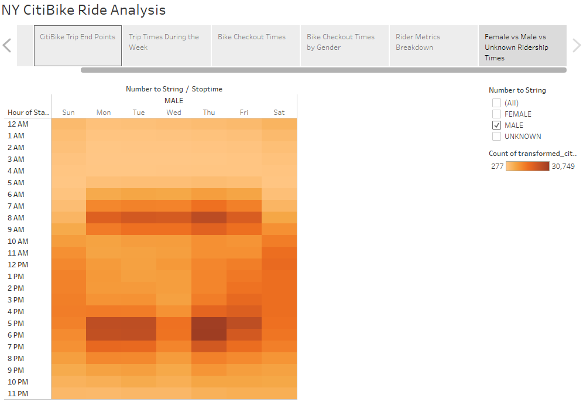

# City Bike Share

## [Tableau Story Here]()

### Overview

The purpose of this analysis was to analyze ridership of the CitiBike system in New York City to see what could be learned for potential implementation in our own city. 

### Results
We selected August as the peak riding season to gague general usage and populatiry. We learned the CitiBike is incredibly populat in New York, with 2,344,244 rides in that month alone. The traffic of the riderhsip was concentrated in the downtown area, as can be seen below in these two graphics, the first of which shows locations where trips began, and the second of which shows where trips ended. 

We can see that ridership is high, but the next question is when is the ridership high and what is the primary usage of the bikes. The following visualization shows that there is continuous usage throughout the week, but on weekdays it is concentrates between 7 to 9 in the morning, and 5 to 7 at night. These are communiting hours, so we can assume a good portion of the ridership uses the bikes to commute. 

The trip duration bears this out, with bikes being used equally for short trips and longer trips, or the equivalent of a workday.

We can see there is a distinct breakdown in ridership between male and female riders. I would posit that this is due to the fact that the majority of the female commuting population do not have work wardrobes condusive to riding a bike. 

While there seems to be a consistent distribution of trip durations between male and female riders, even if the quantity of each is different, there seems to be very little change in riders of an unknown gender. The following rider metrics breakdown may help answer that question. The chart divides riders between CitiBike "subscribers" and single use customers. We can see that there are very very few subscribers of an unknown gender. That means the the majority of gendered riders are subscribers, or regular users of the platform. 

The usage trends between subscriber and single use customers also shows that single use customers are far more likely to use the bikes on the weekends than their subscriber counterparts. This suggests that the single-use customers do not necessarily follow the same trends.

This can be seen in more detail in the following three charts. We can see that there are generally more male riders than female riders, and that both are concentrated during weekday commuting times.

  

We can see that for unknown gender riders, however, their usage is concentrated on the weekends.

## Summary

This data suggests that New York CitiBike ridership is concentrated in urban areas and the majority of their riders are male subscribers who commute for work. There is also  heavy single-use ridership on weekends, which paired with the locations frequented by the riders, suggests they are used by tourists to see the city. 

I would recommend looking into the distance between ride start and stop points as a next step in this analysis. This will be helpful when looking at our own city centers and identifying areas to implement a CitiBike program to see if our city's layout is condusive to incentivizing a similarly large subscribing commuter customer base. I would also be interested in looking at whether certain of those start and stop stations are particularly frequented by either subscribers or customer type riders, and see if there is any information to be gleaned from the interested of the different types of ridership in terms of distance and duration of rides. For example, if most single-use riders are interested in rides through central park, this would be helpful when targeting potential tourists in our own city for what types of locations they would be interested in riding to. 
